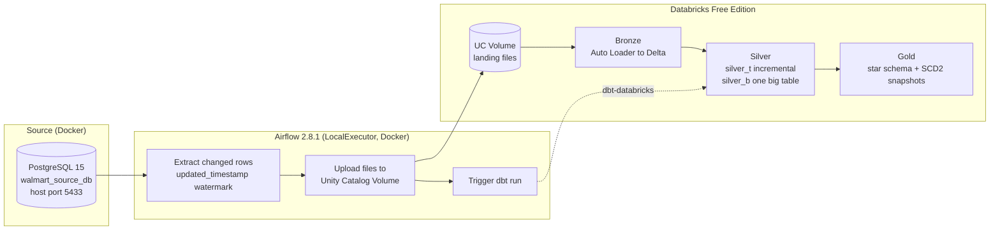
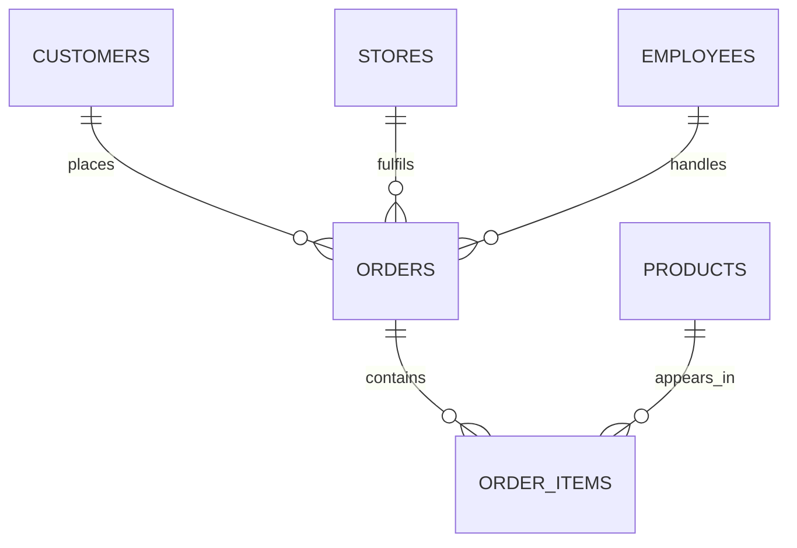

# Walmart End-to-End Data Engineering Project

An incremental ELT pipeline for Walmart retail data. A local PostgreSQL database acts as the operational source, **Apache Airflow** orchestrates extraction, **Databricks** (Unity Catalog, Auto Loader, Delta Lake) stores the medallion layers, and **dbt** builds the silver and gold models, including a star schema and SCD Type 2 snapshots.

Based on the walkthrough by Ansh Lamba ([anshlambagit/Walmart_Airflow_DBT_Project](https://github.com/anshlambagit/Walmart_Airflow_DBT_Project)), adapted to run with a local Postgres source and a push-based ingestion route.


---

## Table of contents

1. [Goals](#goals)
2. [Architecture](#architecture)
3. [Tech stack](#tech-stack)
4. [Source data model](#source-data-model)
5. [Pipeline in detail](#pipeline-in-detail)
6. [Repository layout](#repository-layout)
7. [Getting started](#getting-started)
8. [Project status](#project-status)
9. [Design decisions](#design-decisions)
10. [Troubleshooting](#troubleshooting)

---

## Goals

- Learn data engineering fundamentals and the tools behind them, both practice and theory.
- Build a realistic incremental pipeline: watermark extraction, idempotent loads, medallion layers, dimensional modelling, slowly changing dimensions.
- Produce a portfolio-ready project that runs fully on free tooling (GitHub Codespaces, Databricks Free Edition, Docker).

---

## Architecture



**Why push, not pull?** Databricks Free Edition has restricted outbound internet access, so it cannot reach a database running in a Codespace. Airflow therefore extracts from Postgres and pushes files into a Unity Catalog Volume using the Databricks SDK.

### Data flow by stage

| Stage | Tool | Input | Output | Load pattern |
|---|---|---|---|---|
| Source load | `load_data.py` | CSVs in `walmart_dataset/` | 6 Postgres tables | Truncate and reload in one transaction (idempotent) |
| Extract | Airflow task | Postgres tables | Files (per table, per run) | Incremental by `updated_timestamp` watermark |
| Land | Airflow + Databricks SDK | Files | Files in UC Volume | Append new files |
| Bronze | Auto Loader | Volume files | Delta tables | Streaming-style incremental ingest, schema evolution |
| Silver `silver_t` | dbt | Bronze | Cleaned, typed tables | Incremental models |
| Silver `silver_b` | dbt | `silver_t` | One big table (OBT) joining orders, items, products, customers, stores, employees | Incremental or table |
| Gold | dbt | Silver | Fact and dimension tables, SCD2 snapshots | Star schema + snapshots |

---

## Tech stack

| Layer | Tool | Details |
|---|---|---|
| Dev environment |   | GitHub Codespaces, Docker and Docker Compose |
| Source database |  | PostgreSQL 15 |
| Orchestration |  | Apache Airflow 2.8.1 (Python 3.10, LocalExecutor), separate metadata Postgres |
| Lakehouse |   | Databricks Free Edition, Unity Catalog, Delta Lake |
| Ingestion |  | Databricks SDK (upload), Auto Loader (`cloudFiles`) |
| Transformation |  | dbt Core with the `dbt-databricks` adapter |
| Language and tooling |  | Python 3.10, `uv` for virtualenv and dependencies |

---

## Source data model

Schema `public` in `walmart_db`. Every table has a `BIGINT` primary key plus `created_timestamp`, `updated_timestamp` and `is_active CHAR(1)`. No foreign keys are declared in the DDL.



The relationships above are logical (used for joins in silver and gold), not enforced in Postgres.

| Table | Rows loaded |
|---|---|
| customers | 2,000 |
| stores | 25 |
| products | 500 |
| employees | 250 |
| orders | 10,000 |
| order_items | 30,021 |

The `updated_timestamp` column drives incremental extraction, and `is_active` supports soft deletes and SCD2 handling downstream.

---

## Pipeline in detail

### 1. Extraction (Airflow)

- One task group per table, so tables extract in parallel.
- Each run reads the last stored watermark, selects rows with `updated_timestamp > watermark`, writes a file, then advances the watermark only after a successful upload.
- Files are named per table and run timestamp so reruns are traceable and safe.

### 2. Landing and bronze

- Files land in a Unity Catalog Volume, one folder per table.
- Auto Loader tracks which files it has already processed, so bronze loads are incremental without custom bookkeeping.
- Bronze keeps raw data as received, plus ingestion metadata (source file, load time).

### 3. Silver (dbt)

- `silver_t`: per-table cleaning, type casting, deduplication on primary key (latest `updated_timestamp` wins), incremental materialisation.
- `silver_b`: one big table joining the business entities for easy analytics.

### 4. Gold (dbt)

- Dimensions: customer, store, product, employee, date.
- Fact tables: order and order item grain.
- **SCD Type 2** via dbt snapshots on the dimensions that change over time (valid-from, valid-to, current flag).

### 5. Orchestration

A single Airflow DAG runs the chain end to end: extract, upload, trigger bronze load, then run `dbt build` (models, tests, snapshots).

---

## Repository layout

Current and planned structure (planned items marked).

```
.
├── docker-compose.yml          # Source Postgres, Airflow metadata DB, Airflow webserver + scheduler
├── .env.example                # Template for secrets (DATABRICKS_HOST, DATABRICKS_TOKEN, DB creds)
├── .env                        # Local secrets, git-ignored
├── .gitignore
├── walmart_dataset/
│   ├── *.csv                   # Source datasets
│   ├── ddl/walmart_schema.sql  # Runs via docker-entrypoint-initdb.d
│   └── load_data.py            # Idempotent truncate-and-reload loader
├── dags/                       # (planned) Airflow DAGs
├── scripts/                    # (planned) Databricks setup: bronze schema, landing volume
└── dbt/                        # (planned) dbt project: silver_t, silver_b, gold, snapshots, tests
```

---

## Getting started

### Prerequisites

- GitHub Codespaces (or any Linux box) with Docker and Docker Compose
- Python 3.10 and [`uv`](https://github.com/astral-sh/uv)
- A Databricks Free Edition workspace and a personal access token

### 1. Configure secrets

```bash
cp .env.example .env
# Fill in DATABRICKS_HOST and DATABRICKS_TOKEN, plus Postgres credentials
```

### 2. Start the stack

```bash
docker compose up -d
```

If you restarted the Codespace, Docker networking may need this first:

```bash
sudo iptables-legacy -P FORWARD ACCEPT
```

### 3. Load the source data

```bash
uv venv --python 3.10
source .venv/bin/activate
uv pip install -r requirements.txt   # or the project's dependency file
python walmart_dataset/load_data.py
```

Verify:

```bash
docker exec -it walmart-source-db psql -U <user> -d walmart_db -c "\dt"
```

You should see all six tables.

### 4. Open Airflow

Webserver is exposed from the Compose stack (check the mapped port in `docker-compose.yml`, in Codespaces use the Ports tab).

### 5. Verify Databricks connectivity

Run the Databricks SDK connection test from the Codespace using the values in `.env`.

---

## Project status

| Phase | Scope | Status |
|---|---|---|
| 0 | Repo skeleton, `.gitignore`, `.env` and `.env.example` | Done |
| 1 | Local Postgres source on port 5433, idempotent loader, all tables verified | Done |
| 2 | Airflow stack running (webserver, scheduler, metadata DB), Databricks SDK connection test | Done |
| 3 | Bronze schema and landing volume setup in Unity Catalog | Next |
| 4 | Extract-and-land Airflow task with watermark | Planned |
| 5 | Auto Loader bronze ingestion | Planned |
| 6 | dbt project: `silver_t`, `silver_b` | Planned |
| 7 | dbt gold: star schema, SCD2 snapshots, tests | Planned |
| 8 | End-to-end DAG, docs, portfolio write-up | Planned |

---

## Design decisions

| Decision | Reason |
|---|---|
| Local Postgres instead of an external hosted source | No dependency on a third-party host, full control over data and timestamps |
| Push ingestion (Airflow to Volume) | Free Edition restricts outbound internet, so Databricks cannot pull from Codespaces |
| Watermark on `updated_timestamp` | Simple, cheap incremental extraction that works with the existing schema |
| Auto Loader for bronze | Built-in file tracking and schema evolution |
| dbt for silver and gold | Tested, versioned, documented SQL transformations with built-in snapshot support for SCD2 |
| Separate Airflow metadata Postgres | Keeps orchestration state isolated from source data |
| LocalExecutor | Enough for a single-machine project without Celery or Kubernetes overhead |

---

## Troubleshooting

| Symptom | Fix |
|---|---|
| Containers cannot reach each other after a Codespace restart | `sudo iptables-legacy -P FORWARD ACCEPT`, then `docker compose up -d` |
| Source tables missing | The DDL only runs on first init of the Postgres volume. Remove the volume and recreate, or run the DDL manually |
| Databricks auth errors | Re-check `DATABRICKS_HOST` (include `https://`) and regenerate the token if expired |
| Reloading source data | `load_data.py` truncates and reloads in one transaction, so it is safe to rerun |

---

## Credits

Walkthrough and original project by Ansh Lamba. Adapted and extended as a learning project.